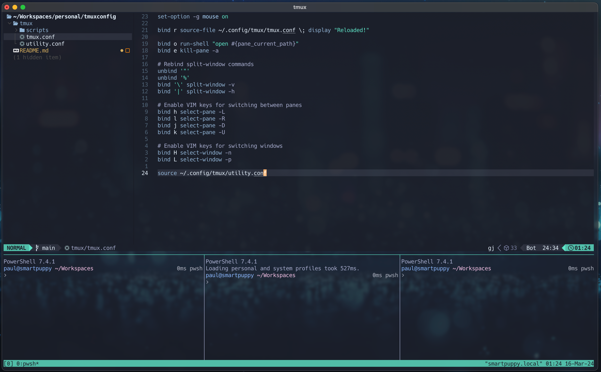

# Small talk about …

In this repository, you will find all of my personal settings for tmux. Configuration has keyboard shortcuts that I use them a lot in what I'm doing. It's not ideal and other collegs have much more color in their themes and other functionalities, but I love ideas of minimalist world.

Before getting started, you should install [Lazygit](https://github.com/jesseduffield/lazygit). I use this package a lot and find it useful.

## Install

Copy the tmux folder into the next folder ~/.config/\*. Use of this folder in Linux and MacOS - I didn’t check my configuration in Windows.

### Additional keyboard shortcuts

`Ctrl` `b` `r` - Reload tmux online if you changed config files (I used it when developing this config).

`Ctrl` `b` `o` - Open the folder that contains the current pane.

`Ctrl` `b` `e` - Close all panes in the window expect of the current one.

`Ctrl` `b` `\` - Split window by horizontally.

`Ctrl` `b` `|` - Split window by vertically.

`Ctrl` `b` `h` - Switch to the left pane of the window.

`Ctrl` `b` `l` - Switch to the right pane of the window.

`Ctrl` `b` `j` - Switch to the bottom pane of the window.

`Ctrl` `b` `k` - Switch to the top pane of the window.

`Ctrl` `b` `H` - Go to the previous window.

`Ctrl` `b` `L` - Go to the next window.

`Ctrl` `b` `g` - Open lazygit plugin for current path.

`Ctrl` `b` `F12` - Run ./scripts/ide to open Terminal as an IDE with some number of panes (work only in tmux session).

### References

[github.com/tmux/tmux](https://github.com/tmux/tmux)

[github.com/jesseduffield/lazygit](https://github.com/jesseduffield/lazygit)

[github.com/olivercederborg/poimandres.nvim](https://github.com/olivercederborg/poimandres.nvim)

[github.com/rumaan/poimandres-iterm](https://github.com/rumaan/poimandres-iterm)

[github.com/craftzdog/dotfiles-public](https://github.com/craftzdog/dotfiles-public)
